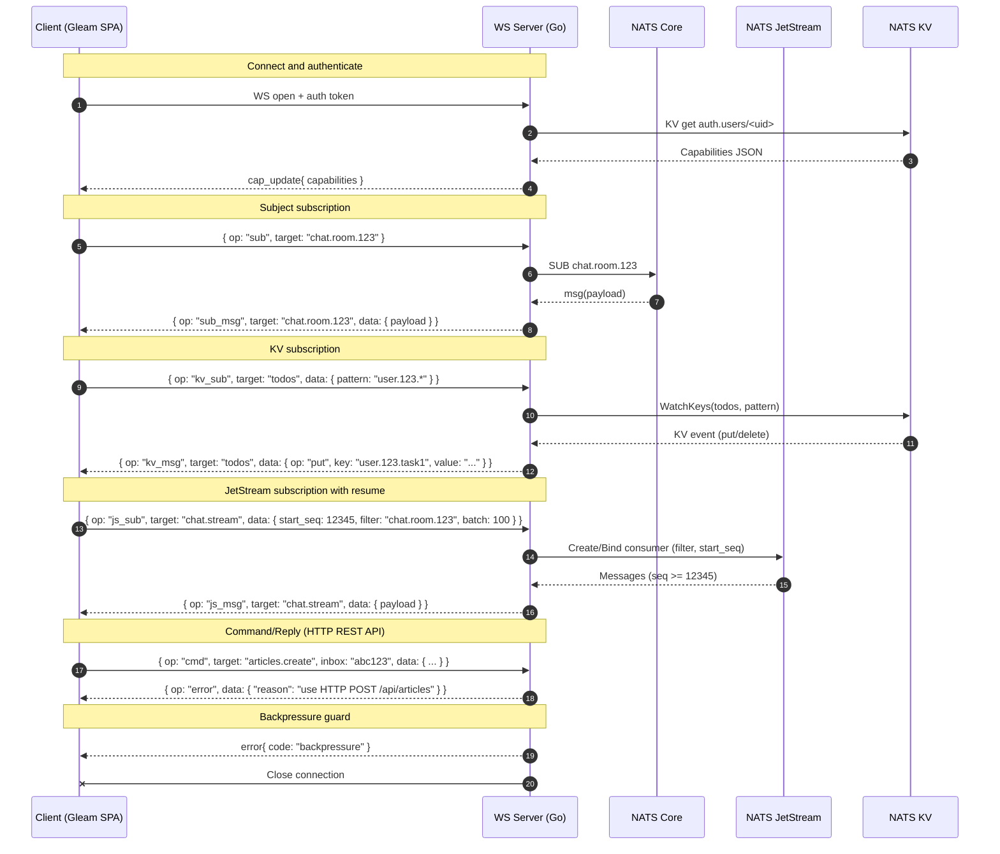

# Architecture & Refactor Plan

## Overview
Real-time SPA: Gleam+Lustre frontend + Go WebSocket server + NATS (Core, JetStream, KV).

**Architecture**: 
- **WebSocket**: Real-time data sync only (sub, kv_sub, js_sub)
- **HTTP REST API**: Request-response operations (CRUD, commands)
- **Data Flow**: HTTP API → Backend → WebSocket → Frontend state update

## Goals
- **WebSocket**: Real-time subscriptions with pattern-based access control (`*`, `>` wildcards)
- **HTTP REST API**: CRUD operations, commands, JWT auth (no frontend state updates)

---

### Protocol Specification

#### WebSocket (Real-time Subscriptions)
```json
{
  "op": "sub" | "unsub" | "kv_sub" | "js_sub" | "cap_update" | "error",
  "target": "subject-or-bucket-or-stream",
  "inbox": "optional-correlation-id",
  "data": { }
}
```

**Operations**: `sub`, `unsub`, `kv_sub`, `js_sub`
**Messages**: `sub_msg`, `kv_msg`, `js_msg`, `cap_update`, `error`
**Note**: No `cmd`/`reply` - commands use HTTP REST API

#### HTTP REST API
- **Articles**: `GET/POST/PUT/DELETE /api/articles`
- **Auth**: `POST /api/auth/login`, `POST /api/auth/logout`
- **Users**: `GET/POST/PUT/DELETE /api/users`
- **Commands**: `POST /api/commands/{command}`

**Note**: WebSocket for data sync only. HTTP for operations. Frontend state updated ONLY from WebSocket.

**Message Examples**:
- **Subject**: `{ "op": "sub_msg", "target": "chat.room.123", "data": { "payload": {} } }`
- **KV**: `{ "op": "kv_msg", "target": "todos", "data": { "key": "user.123.task.1", "op": "put", "value": {} } }`
- **JetStream**: `{ "op": "js_msg", "target": "chat.stream", "data": { "seq": 12345, "payload": {} } }`

---

### Backend (Go) Implementation Plan

#### 1) Capabilities
```go
// Capabilities describe allowed operations per user/session
// Wildcards: * and > (subject-style patterns)
type Capabilities struct {
    Subjects []string            `json:"subjects"`
    Buckets  map[string][]string `json:"buckets"`  // bucket pattern -> allowed key patterns
    Commands []string            `json:"commands"`
    Streams  map[string][]string `json:"streams"`  // stream pattern -> allowed filter subject patterns
}
```

- Pattern matching: use `nats.Match` semantics for `*` and `>`.
- Checks:
  - `isAllowedSubject(subject string)`
  - `isAllowedKV(bucket, keyPattern string)`
  - `isAllowedStream(stream, filter string)`
  - `isAllowedCommand(target string)`

Implementation notes:
- Normalize and cache capability patterns at session start for faster checks.
- Keep a per-connection registry of active subs: subject, kv watches, js consumers; include the capability pattern that authorized it for quick revocation.

#### 2) Auth Change Handling
- Watch `auth.users` KV for the user’s key.
- On update:
  - Parse new capabilities.
  - Diff against current; unsubscribe and close consumers not allowed anymore.
  - Send `cap_update` with the new effective capabilities.

#### 3) Subject Subscriptions (Core NATS)
- Enforce `isAllowedSubject(target)` on `sub`.
- Create a subscription; each incoming message is forwarded as `msg` with `target` as the subject.
- Keep a `subID` map if needed to support `unsub` by identifier.

#### 4) KV Subscriptions
- Enforce `isAllowedKV(bucket, pattern)` on `kv_sub`.
- If `pattern` provided use `kv.WatchKeys(pattern)`, else `kv.WatchAll()`.
- Forward watch events as `msg` with `target` `kv:<bucket>` and include `{ key, revision, op, value }`.

#### 5) JetStream Subscriptions
- Enforce `isAllowedStream(stream, filter)` on `js_sub`.
- Build a durable or ephemeral consumer:
  - Optional `filter` via `nats.FilterSubject(filter)`.
  - Start position via `start_seq` if provided; default to latest.
  - `batch` controls server-side pull size (flow control).
- Forward each message as `msg` with `target` `js:<stream>` and include `{ seq, subject, payload }`.
- Consider at-least-once delivery with explicit acks where necessary.

#### 6) Commands
**Architecture Decision**: Commands will use HTTP REST API, not WebSocket
- WebSocket handles real-time subscriptions only
- HTTP API handles all CRUD operations and commands
- Frontend state updated through WebSocket subscriptions

#### 7) Backpressure
- Outbound send queue `sendCh` with bounded buffer.
- Writer goroutine selects on `sendCh` with a 250ms timeout.
  - If blocked: emit an `error` message with a backpressure code and close the connection.
- Optionally expose `server_overloaded` metric and increment a counter.

#### 8) Context Propagation & Cleanup
- All NATS subs, KV watchers, and goroutines use a per-client `context.Context`.
- On disconnect, cancel the context and wait for goroutines to exit.
- Ensure consumers and watchers are drained and closed.

---

### Frontend (Gleam) Implementation Plan

#### 1) `sync.gleam` Model (Current Implementation)
```gleam
pub type KV(key, value) {
  KV(
    id: String,
    state: KVState,
    bucket: String,
    filter: Option(String),
    revision: Int,
    data: Dict(key, value),
    encoder_key: fn(key) -> Json,
    encoder_value: fn(value) -> Json,
    decoder_key: Decoder(key),
    decoder_value: Decoder(value)
  )
}
```

**Current Status**: KV-focused WebSocket subscription and data management
**Features**: Automatic state management, revision tracking, error handling
**Missing**: Subject subscriptions, JetStream subscriptions, capabilities

#### 2) Current Helpers
- ✅ `new_kv()` - Create new KV subscription
- ✅ `ws_text_message()` - Handle WebSocket messages
- ✅ `ws_open()` - Handle WebSocket connection
- ❌ Subject subscriptions - Not implemented
- ❌ JetStream subscriptions - Not implemented

#### 3) Article Operations (Current)
- **Frontend Messages**: `ArticleCreate`, `ArticleUpdate`, `ArticleDelete`, etc.
- **Implementation**: These will use HTTP REST API, not WebSocket
- **Real-time Updates**: WebSocket subscriptions for data sync only

#### 4) Future Implementation
- Subject subscriptions (NATS Core)
- JetStream subscriptions with resume support
- Capability handling
- Command operations via HTTP REST API

---

### Example Capability JSON in Auth KV
```json
{
  "subjects": ["chat.room.*", "articles.>"],
  "buckets": {
    "todos": ["user.123.*"],
    "articles": [">"]
  },
  "commands": [],
  "streams": {
    "chat.stream": ["chat.room.123", "chat.room.456"],
    "audit.stream": [">"]
  }
}
```

**Note**: `commands` field exists but is unused. All operations use HTTP REST API.

---

### Architecture Diagram (Mermaid)


---

### Data Flow and State Management

#### Frontend State Update Rules
1. **WebSocket Only**: All data model updates come through WebSocket subscriptions
2. **HTTP Acknowledgment**: HTTP responses confirm operation success but don't modify frontend state
3. **Real-time Sync**: Changes made via HTTP API automatically appear through WebSocket subscriptions
4. **Consistent State**: Single source of truth from WebSocket ensures data consistency

#### Fallback Strategy
- **Primary**: WebSocket for real-time updates
- **Fallback**: Long polling if WebSocket connection issues arise
- **Graceful Degradation**: App remains functional with slightly delayed updates during fallback

---

### Testing Checklist

#### WebSocket (Real-time Subscriptions)
- [ ] Connect with valid capabilities.
- [ ] Subscribe to allowed subject → success.
- [ ] Subscribe to disallowed subject → denied.
- [ ] KV subscribe with allowed pattern → success.
- [ ] KV subscribe with disallowed pattern → denied.
- [ ] JS subscribe with allowed filter → success.
- [ ] JS subscribe with disallowed filter → denied.
- [ ] Auth KV update removes access → unsubscribed + `cap_update` sent.
- [ ] Backpressure test: block `sendCh` → connection closed after 250ms.

#### HTTP REST API (Request-Response)
- [ ] CRUD operations for articles
- [ ] Authentication endpoints
- [ ] User management endpoints
- [ ] Command endpoints
- [ ] JWT authorization and permissions

---

### Next Steps

#### WebSocket Enhancements
- Implement time-based resume for JetStream when `last_seq == 0` (e.g., start from `time_delta` seconds ago).
- Add durable consumer support for long-lived JetStream subscriptions (naming per user/session).
- Add per-message ack support for at-least-once delivery in critical streams.
- Consider heartbeat `ping/pong` at the protocol level for faster dead-connection detection.
- Add protocol versioning in the envelope (e.g., `v: 1`) to allow non-breaking evolution.

#### HTTP REST API Implementation
- Implement full CRUD operations for articles
- Add authentication and user management endpoints
- Implement command endpoints for business operations
- Add comprehensive JWT authorization and permission system
- Consider implementing WebSocket command protocol in the future for real-time commands
