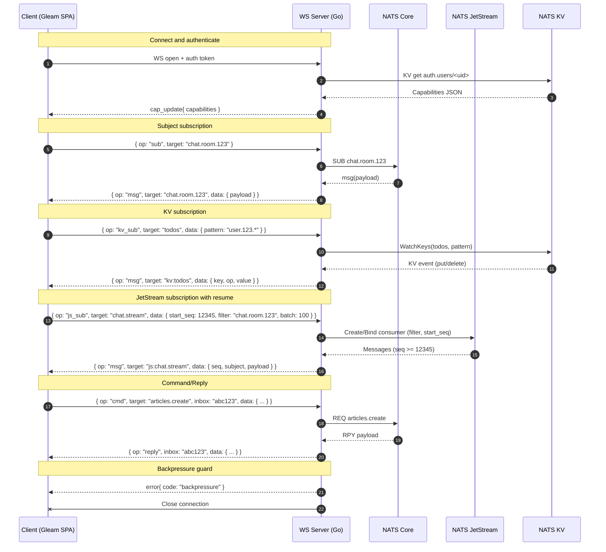

## ARCHITECTURE_AND_REFACTOR_PLAN

### Overview
We are building a real-time SPA architecture using:

- **Frontend**: Gleam + Lustre SPA with a `realtime.gleam` infrastructure module.
- **Backend**: Go WebSocket server bridging to NATS (Core, JetStream, KV).
- **Transport**: Single WebSocket connection for all commands, subscriptions, and KV/stream updates.
- **Data Flow**:
  - Client subscribes to NATS subjects, KV buckets, or JetStream streams via WebSocket messages.
  - Backend enforces capabilities (auth-based access control) with pattern matching.
  - Backend pushes updates to the client in real time.
  - Client sends commands (NATS requests) and receives replies correlated via an inbox token.

### Goals
1. Unified protocol for all operations.
2. Capabilities with pattern-based access control (`*` and `>` wildcards).
3. KV subscriptions with optional key patterns.
4. JetStream subscriptions with optional filter subjects.
5. Resumeability for JetStream via sequence numbers.
6. Backpressure handling with connection close on timeout.
7. Auth change handling via Auth KV watch.
8. Frontend helpers for commands, KV, and JetStream resume.

---

### Protocol Specification
All messages are JSON objects with the following envelope:

```json
{
  "op": "sub" | "unsub" | "kv_sub" | "js_sub" | "cmd" | "msg" | "reply" | "cap_update" | "error",
  "target": "subject-or-bucket-or-stream",
  "inbox": "optional-correlation-id",
  "data": { }
}
```

- **sub**: Subscribe to a NATS subject. `data` can include `{ "queue": "optional-queue-group" }`.
- **unsub**: Unsubscribe from a previously created subscription. `data` includes `{ "id": "server-sub-id" }` if needed.
- **kv_sub**: Subscribe to a KV bucket. `data` can include `{ "pattern": "keys.pattern.*" }`.
- **js_sub**: Subscribe to a JetStream stream. `data` can include `{ "start_seq": 0, "batch": 100, "filter": "optional.subject" }`.
- **cmd**: Send a command (NATS request) with `inbox` for correlation. `data` is the request payload.
- **msg**: Server → client message for a subscription/KV/stream update. `data` contains the event payload and metadata.
- **reply**: Server → client reply to a `cmd`, echoes `inbox`.
- **cap_update**: Server → client capabilities update; `data` contains the full effective capabilities after change.
- **error**: Server → client error message; `data` includes `{ "code": "string", "message": "string", "context": { } }`.

Recommended server message payloads:

- For subject messages:
```json
{
  "op": "msg",
  "target": "chat.room.123",
  "data": {
    "payload": { },
    "meta": { "ts": 1710000000 }
  }
}
```

- For KV events:
```json
{
  "op": "msg",
  "target": "kv:todos",
  "data": {
    "key": "user.123.task.1",
    "revision": 42,
    "op": "put" | "delete" | "purge",
    "value": { }
  }
}
```

- For JetStream events:
```json
{
  "op": "msg",
  "target": "js:chat.stream",
  "data": {
    "seq": 12345,
    "subject": "chat.room.123",
    "payload": { }
  }
}
```

---

### Backend (Go) Implementation Plan

#### 1) Capabilities
```go
// Capabilities describe allowed operations per user/session
// Wildcards: * and > (subject-style patterns)
type Capabilities struct {
    Subjects []string            `json:"subjects"`
    Buckets  map[string][]string `json:"buckets"`  // bucket pattern -> allowed key patterns
    Commands []string            `json:"commands"`
    Streams  map[string][]string `json:"streams"`  // stream pattern -> allowed filter subject patterns
}
```

- Pattern matching: use `nats.Match` semantics for `*` and `>`.
- Checks:
  - `isAllowedSubject(subject string)`
  - `isAllowedKV(bucket, keyPattern string)`
  - `isAllowedStream(stream, filter string)`
  - `isAllowedCommand(target string)`

Implementation notes:
- Normalize and cache capability patterns at session start for faster checks.
- Keep a per-connection registry of active subs: subject, kv watches, js consumers; include the capability pattern that authorized it for quick revocation.

#### 2) Auth Change Handling
- Watch `auth.users` KV for the user’s key.
- On update:
  - Parse new capabilities.
  - Diff against current; unsubscribe and close consumers not allowed anymore.
  - Send `cap_update` with the new effective capabilities.

#### 3) Subject Subscriptions (Core NATS)
- Enforce `isAllowedSubject(target)` on `sub`.
- Create a subscription; each incoming message is forwarded as `msg` with `target` as the subject.
- Keep a `subID` map if needed to support `unsub` by identifier.

#### 4) KV Subscriptions
- Enforce `isAllowedKV(bucket, pattern)` on `kv_sub`.
- If `pattern` provided use `kv.WatchKeys(pattern)`, else `kv.WatchAll()`.
- Forward watch events as `msg` with `target` `kv:<bucket>` and include `{ key, revision, op, value }`.

#### 5) JetStream Subscriptions
- Enforce `isAllowedStream(stream, filter)` on `js_sub`.
- Build a durable or ephemeral consumer:
  - Optional `filter` via `nats.FilterSubject(filter)`.
  - Start position via `start_seq` if provided; default to latest.
  - `batch` controls server-side pull size (flow control).
- Forward each message as `msg` with `target` `js:<stream>` and include `{ seq, subject, payload }`.
- Consider at-least-once delivery with explicit acks where necessary.

#### 6) Commands
- On `cmd`, check `isAllowedCommand(target)`.
- Use `nats.RequestWithContext` and echo `inbox` in a `reply` message along with the response payload.

#### 7) Backpressure
- Outbound send queue `sendCh` with bounded buffer.
- Writer goroutine selects on `sendCh` with a 250ms timeout.
  - If blocked: emit an `error` message with a backpressure code and close the connection.
- Optionally expose `server_overloaded` metric and increment a counter.

#### 8) Context Propagation & Cleanup
- All NATS subs, KV watchers, and goroutines use a per-client `context.Context`.
- On disconnect, cancel the context and wait for goroutines to exit.
- Ensure consumers and watchers are drained and closed.

---

### Frontend (Gleam) Implementation Plan

#### 1) `realtime.gleam` Model
```gleam
pub type Model {
  Model(
    socket: Option(websocket.Connection),
    subs: List(String),
    kv_subs: List(String),
    js_subs: List(#(String, Int, Int, String)), // stream, start_seq, batch, filter
    pending_cmds: map.Map(String, fn(json.Json) -> Msg)
  )
}
```

- Track last-seen JetStream sequence per domain to support resume.
- Maintain connection state and exponential backoff reconnection.

#### 2) Helpers
- `subscribe(subject: String)`
- `kv_subscribe(bucket: String)`
- `kv_subscribe_pattern(bucket: String, pattern: String)`
- `js_subscribe(stream: String, start_seq: Int, batch: Int, filter: String)`
- `js_resume(stream: String, last_seq: Int, batch: Int, filter: String)`
- `send_command(target: String, payload: json.Json, cb: fn(json.Json) -> Msg)`

#### 3) Resumeability
- Store `last_seq` in the domain model.
- On reconnect, call `js_resume` with `last_seq` to pick up where left off.
- If `last_seq == 0`, fall back to time-based resume (see Next Steps).

#### 4) Command Replies
- Client generates a unique `inbox` for each command.
- Stores callback in `pending_cmds` keyed by `inbox`.
- On `reply`, looks up callback by `inbox` and dispatches the message.

---

### Example Capability JSON in Auth KV
```json
{
  "subjects": ["chat.room.*", "articles.>"],
  "buckets": {
    "todos": ["user.123.*"],
    "articles": [">"]
  },
  "commands": ["articles.create", "todos.add"],
  "streams": {
    "chat.stream": ["chat.room.123", "chat.room.456"],
    "audit.stream": [">"]
  }
}
```

---

### Architecture Diagram (Mermaid)


---

### Testing Checklist
- [ ] Connect with valid capabilities.
- [ ] Subscribe to allowed subject → success.
- [ ] Subscribe to disallowed subject → denied.
- [ ] KV subscribe with allowed pattern → success.
- [ ] KV subscribe with disallowed pattern → denied.
- [ ] JS subscribe with allowed filter → success.
- [ ] JS subscribe with disallowed filter → denied.
- [ ] Command with allowed target → reply received.
- [ ] Command with disallowed target → denied.
- [ ] Auth KV update removes access → unsubscribed + `cap_update` sent.
- [ ] Backpressure test: block `sendCh` → connection closed after 250ms.

---

### Next Steps
- Implement time-based resume for JetStream as a fallback when `last_seq` is `0` (e.g., start from `time_delta` seconds ago).
- Add durable consumer support for long-lived JetStream subscriptions (naming per user/session).
- Add per-message ack support for at-least-once delivery in critical streams.
- Consider heartbeat `ping/pong` at the protocol level for faster dead-connection detection.
- Add protocol versioning in the envelope (e.g., `v: 1`) to allow non-breaking evolution.