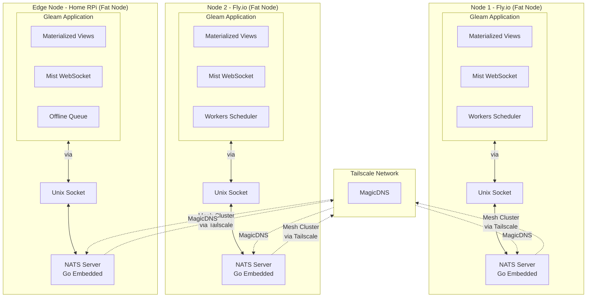
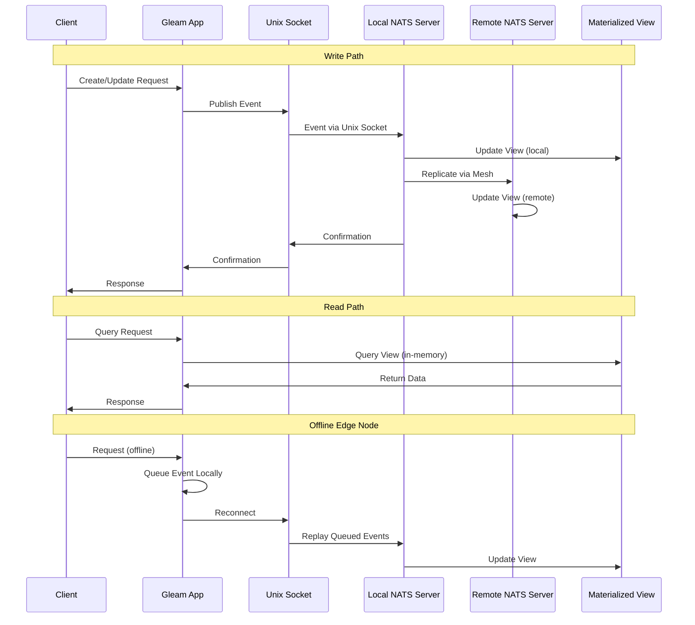

# NATS-Only Persistence Architecture Migration Plan

## Executive Summary

This document outlines the migration of `jst_dev` from a SQLite-based single-node architecture to a distributed, multi-node system using **embedded NATS JetStream** as the sole persistence layer. Each node is a "fat node" containing both the Gleam application and an embedded NATS server (Go). The Gleam app communicates with its local NATS server via Unix socket, and NATS servers form a mesh cluster via Tailscale MagicDNS. All data (events, key-value stores, files) is stored in NATS, with each node maintaining in-memory materialized views rebuilt from event streams. This architecture enables edge nodes with offline capabilities, real-time synchronization, and horizontal scaling without external databases.

## Table of Contents

1. [Architecture Overview](#architecture-overview)
2. [Core Principles](#core-principles)
3. [Technology Stack](#technology-stack)
4. [Current State Analysis](#current-state-analysis)
5. [Target Architecture](#target-architecture)
6. [Implementation Phases](#implementation-phases)
7. [Detailed Implementation Guide](#detailed-implementation-guide)
8. [Migration Strategy](#migration-strategy)
9. [Testing Strategy](#testing-strategy)
10. [Deployment Considerations](#deployment-considerations)
11. [Performance Considerations](#performance-considerations)
12. [Risk Mitigation](#risk-mitigation)

---

## Architecture Overview

### High-Level Architecture



### Data Flow



---

## Core Principles

### 1. Event Sourcing
- All state changes are events stored in JetStream streams
- Events are immutable and append-only
- Views are rebuilt by replaying events

### 2. Materialized Views
- Each node maintains in-memory views for fast reads
- Views are rebuilt on startup by replaying events
- Views are updated in real-time as new events arrive

### 3. NATS-Only Persistence
- **JetStream Streams**: All events (articles, chat, documents, etc.)
- **JetStream KV**: Key-value data (sessions, config, metadata)
- **JetStream Object Store**: Files (documents, images, attachments)
- **No External Databases**: No PostgreSQL, no S3, no SQLite

### 4. Offline-First Edge Nodes
- Edge nodes queue events when offline
- Replay queued events on reconnection
- Partial views: Only subscribe to needed streams

### 5. Fat Node Architecture
- Each node is self-contained with embedded NATS server
- NATS servers form mesh cluster via Tailscale
- Gleam app communicates with local NATS via Unix socket
- Each node rebuilds views independently
- No coordination needed for reads

### 6. Horizontal Scaling
- Add nodes by deploying new fat nodes
- NATS servers automatically discover each other via Tailscale MagicDNS
- Each node rebuilds views independently
- No coordination needed for reads

---

## Technology Stack

| Component | Technology | Purpose |
|-----------|-----------|---------|
| **Language** | Gleam | Type-safe functional language on BEAM |
| **Frontend** | Lustre | Gleam frontend framework with SSR |
| **Web Server** | Wisp + Mist | HTTP routing and WebSocket handling |
| **NATS Server** | NATS (Go) | Embedded NATS server in each node |
| **NATS Client** | `nats.erl` (Erlang) | NATS client library via FFI, connects via Unix socket |
| **Communication** | Unix Socket | Local communication between Gleam and NATS |
| **Messaging** | NATS + JetStream | Pub/sub, event sourcing, persistence |
| **VPN** | Tailscale | Network connectivity with MagicDNS for NATS mesh |
| **Collaborative Editing** | Yjs (JavaScript) | CRDT-based collaborative editing |
| **Push Notifications** | ntfy.sh | HTTP-based push notifications |
| **Deployment** | Fly.io, Docker | Containerized deployment |

---

## Current State Analysis

### Existing Features

1. **Articles**: Create, read, update, delete articles
   - Stored in SQLite `articles` table
   - WebSocket pub/sub for real-time updates
   - Current: `server/src/jst_server/db.gleam`, `shared/src/shared/article.gleam`

2. **Short URLs**: URL shortener with access tracking
   - Stored in SQLite `short_urls` table
   - Current: `shared/src/shared/short_url.gleam`

3. **Chat**: Chat rooms and messages
   - Stored in SQLite (implied)
   - WebSocket pub/sub
   - Current: `shared/src/shared/chat.gleam`

4. **Users**: Authentication and authorization
   - Stored in SQLite `users` table
   - Current: `shared/src/shared/user.gleam`

5. **WebSocket Communication**: Real-time updates
   - Current: `server/src/jst_server/ws.gleam`, `server/src/jst_server/pubsub.gleam`
   - Protocol: `shared/src/shared/omni.gleam`

### Current Architecture Issues

1. **Single-Node Limitation**: SQLite + LiteFS only works for single primary node
2. **No Offline Support**: Edge nodes can't queue operations
3. **External Dependencies**: Requires PostgreSQL migration for multi-node
4. **File Storage**: No file storage implementation yet
5. **No Event History**: Can't replay events or rebuild state

---

## Target Architecture

### JetStream Streams

All events will be stored in these streams:

```
jst.events.articles          # Article lifecycle events
jst.events.short_urls        # URL shortener events
jst.events.chat.rooms        # Chat room events
jst.events.chat.messages     # Chat message events
jst.events.documents         # Document events
jst.events.documents.edits   # Collaborative editing events (Yjs)
jst.events.tasks             # Task/planning events
jst.events.notifications     # Notification events
jst.events.users             # User events
jst.events.files             # File upload/download events
```

### JetStream KV Stores

Key-value data for fast lookups:

```
kv.users.sessions.{session_id}     # User sessions
kv.short_urls.{code}               # URL shortener mappings
kv.config.{key}                    # Configuration
kv.metadata.{type}.{id}             # Metadata
kv.tasks.{task_id}                 # Task data
```

### JetStream Object Store

Files and blobs:

```
obj.documents.{doc_id}              # Document files
obj.images.{image_id}               # Images
obj.attachments.{attachment_id}     # Attachments
obj.uploads.{user_id}.{file_id}     # User uploads
```

### Materialized Views

Each node maintains these in-memory views:

```gleam
// Articles View
type ArticlesView {
  ArticlesView(
    by_id: Dict(String, Article),
    by_slug: Dict(String, Article),
    by_author: Dict(String, List(Article)),
    by_tag: Dict(String, List(Article)),
  )
}

// Short URLs View
type ShortUrlsView {
  ShortUrlsView(
    by_id: Dict(String, ShortUrl),
    by_code: Dict(String, ShortUrl),
    active: List(ShortUrl),
  )
}

// Chat View
type ChatView {
  ChatView(
    rooms: Dict(String, ChatRoom),
    messages_by_room: Dict(String, List(ChatMessage)),
  )
}

// Documents View
type DocumentsView {
  DocumentsView(
    by_id: Dict(String, Document),
    by_owner: Dict(String, List(Document)),
    shared: Dict(String, List(Document)),
  )
}

// Tasks View
type TasksView {
  TasksView(
    by_id: Dict(String, Task),
    by_project: Dict(String, List(Task)),
    scheduled: List(Task),
  )
}

// Users View
type UsersView {
  UsersView(
    by_id: Dict(String, User),
    by_username: Dict(String, User),
    by_email: Dict(String, User),
  )
}
```

---

## Implementation Phases

### Phase 1: NATS Foundation (Week 1-2)

**Goal**: Establish embedded NATS server and Gleam connectivity

**Tasks**:
1. Embed NATS server binary (Go) in Docker image
2. Configure NATS server to listen on Unix socket
3. Set up NATS mesh cluster via Tailscale MagicDNS
4. Add `nats.erl` dependency and create Gleam wrapper
5. Connect Gleam app to local NATS via Unix socket
6. Create basic JetStream stream management
7. Implement connection health checks

**Deliverables**:
- Embedded NATS server in Docker container
- NATS server configuration for Unix socket and mesh cluster
- `server/src/jst_server/nats.gleam` - NATS client wrapper
- `server/src/jst_server/nats_ffi.erl` - Erlang FFI functions
- `server/src/jst_server/config.gleam` - NATS configuration
- Connection management with reconnection logic

### Phase 2: Event System (Week 2-3)

**Goal**: Define event schema and publishing infrastructure

**Tasks**:
1. Define all event types in `shared/src/shared/events.gleam`
2. Create event publishing module
3. Set up JetStream streams for all event types
4. Implement event encoding/decoding

**Deliverables**:
- `shared/src/shared/events.gleam` - Event type definitions
- `server/src/jst_server/events.gleam` - Event publishing functions
- Stream initialization on startup
- Event versioning support

### Phase 3: Materialized Views (Week 3-4)

**Goal**: Build view system and rebuild logic

**Tasks**:
1. Create view manager to coordinate all views
2. Implement individual view modules
3. Build view rebuild logic (replay events)
4. Handle event ordering and idempotency

**Deliverables**:
- `server/src/jst_server/views/view_manager.gleam`
- Individual view modules (articles, short_urls, chat, etc.)
- View rebuild on startup
- Event application to views

### Phase 4: Real-Time Subscriptions (Week 4-5)

**Goal**: Subscribe to streams and update views in real-time

**Tasks**:
1. Subscribe to JetStream streams
2. Update views on new events
3. Handle consumer acknowledgments
4. Implement backpressure handling

**Deliverables**:
- Real-time view updates
- Stream subscription management
- Consumer group coordination

### Phase 5: JetStream KV Migration (Week 5-6)

**Goal**: Replace SQLite key-value operations with JetStream KV

**Tasks**:
1. Create KV wrapper module
2. Migrate user sessions to KV
3. Migrate short URL mappings to KV
4. Migrate configuration to KV
5. Remove SQLite dependency

**Deliverables**:
- `server/src/jst_server/kv.gleam` - KV operations
- All key-value data in JetStream KV
- Removed SQLite key-value code

### Phase 6: JetStream Object Store (Week 6-7)

**Goal**: Implement file storage in JetStream Object Store

**Tasks**:
1. Create Object Store wrapper
2. Implement file upload/download
3. Migrate document storage
4. Handle file metadata

**Deliverables**:
- `server/src/jst_server/object_store.gleam`
- File upload/download endpoints
- File events in streams

### Phase 7: Feature Migration (Week 7-9)

**Goal**: Migrate all features to event-driven architecture

**Tasks**:
1. Migrate articles to events + views
2. Migrate short URLs to events + views
3. Migrate chat to events + views
4. Migrate users to events + views
5. Update WebSocket handlers

**Deliverables**:
- All features using events
- All reads from materialized views
- WebSocket integration with NATS

### Phase 8: New Features (Week 9-11)

**Goal**: Implement new features (tasks, documents, collaborative editing)

**Tasks**:
1. Implement scheduled tasks with JetStream delayed delivery
2. Implement document sharing
3. Integrate Yjs for collaborative editing
4. Implement push notifications via ntfy.sh

**Deliverables**:
- `server/src/jst_server/scheduler.gleam`
- Document sharing functionality
- Yjs integration with NATS sync
- `server/src/jst_server/ntfy.gleam`

### Phase 9: Edge Node Support (Week 11-12)

**Goal**: Enable offline capabilities for edge nodes

**Tasks**:
1. Implement offline event queuing
2. Replay queued events on reconnect
3. Partial view subscriptions
4. Handle network partitions

**Deliverables**:
- Offline event queuing
- Reconnection logic
- Partial view support

### Phase 10: Cleanup & Optimization (Week 12-13)

**Goal**: Remove old code and optimize

**Tasks**:
1. Remove all SQLite code
2. Remove LiteFS configuration
3. Optimize view rebuild performance
4. Add monitoring and observability

**Deliverables**:
- Clean codebase
- Performance optimizations
- Monitoring dashboards

---

## Detailed Implementation Guide

### 1. NATS Client Wrapper

**File**: `server/src/jst_server/nats.gleam`

```gleam
import gleam/result
import gleam/option

pub opaque type NatsConnection

pub type NatsError {
  ConnectionError(String)
  PublishError(String)
  SubscribeError(String)
  JetStreamError(String)
}

// Connect to local NATS server via Unix socket
pub fn connect(socket_path: String) -> Result(NatsConnection, NatsError) {
  // FFI to nats.erl
  // Connection string: "unix:///tmp/nats.sock"
}

// Publish to subject
pub fn publish(
  conn: NatsConnection,
  subject: String,
  payload: String,
) -> Result(Nil, NatsError) {
  // FFI implementation
}

// Subscribe to subject
pub fn subscribe(
  conn: NatsConnection,
  subject: String,
  handler: fn(String) -> Nil,
) -> Result(Nil, NatsError) {
  // FFI implementation
}

// JetStream operations
pub fn jetstream_publish(
  conn: NatsConnection,
  stream: String,
  subject: String,
  payload: String,
) -> Result(Nil, NatsError)

pub fn jetstream_subscribe(
  conn: NatsConnection,
  stream: String,
  subject: String,
  handler: fn(String) -> Nil,
) -> Result(Nil, NatsError)

// KV operations
pub fn kv_get(
  conn: NatsConnection,
  bucket: String,
  key: String,
) -> Result(Option(String), NatsError)

pub fn kv_put(
  conn: NatsConnection,
  bucket: String,
  key: String,
  value: String,
) -> Result(Nil, NatsError)

// Object Store operations
pub fn object_store_put(
  conn: NatsConnection,
  bucket: String,
  name: String,
  data: BitArray,
) -> Result(Nil, NatsError)

pub fn object_store_get(
  conn: NatsConnection,
  bucket: String,
  name: String,
) -> Result(Option(BitArray), NatsError)
```

**File**: `server/src/jst_server/nats_ffi.erl`

```erlang
-module(jst_server_nats_ffi).

-export([connect_unix/1, publish/3, subscribe/3, jetstream_publish/4]).

% Connect to local NATS server via Unix socket
connect_unix(SocketPath) ->
    % Format: "unix:///tmp/nats.sock"
    Url = "unix://" ++ SocketPath,
    case nats:connect(Url) of
        {ok, Conn} -> {ok, Conn};
        {error, Reason} -> {error, Reason}
    end.

publish(Conn, Subject, Payload) ->
    case nats:pub(Conn, Subject, Payload) of
        ok -> {ok, nil};
        {error, Reason} -> {error, Reason}
    end.

% ... more FFI functions
```

### 2. Event System

**File**: `shared/src/shared/events.gleam`

```gleam
import gleam/json
import gleam/dynamic/decode

// Article events
pub type ArticleEvent {
  ArticleCreated(article: article.Article)
  ArticleUpdated(article: article.Article)
  ArticleDeleted(id: String)
}

// Short URL events
pub type ShortUrlEvent {
  ShortUrlCreated(url: short_url.ShortUrl)
  ShortUrlUpdated(url: short_url.ShortUrl)
  ShortUrlDeleted(id: String)
  ShortUrlAccessed(code: String)
}

// Chat events
pub type ChatEvent {
  ChatRoomCreated(room: chat.ChatRoom)
  ChatRoomUpdated(room: chat.ChatRoom)
  ChatRoomDeleted(id: String)
  ChatMessageSent(message: chat.ChatMessage)
}

// Document events
pub type DocumentEvent {
  DocumentCreated(document: Document)
  DocumentUpdated(document: Document)
  DocumentDeleted(id: String)
  DocumentShared(document_id: String, user_id: String)
  DocumentEdit(edit: DocumentEdit)  // For Yjs
}

// Task events
pub type TaskEvent {
  TaskCreated(task: Task)
  TaskUpdated(task: Task)
  TaskDeleted(id: String)
  TaskScheduled(task_id: String, run_at: Int)
}

// User events
pub type UserEvent {
  UserCreated(user: user.User)
  UserUpdated(user: user.User)
  UserDeleted(id: String)
  SessionCreated(session: Session)
  SessionDeleted(session_id: String)
}

// File events
pub type FileEvent {
  FileUploaded(file_id: String, metadata: FileMetadata)
  FileDeleted(file_id: String)
}

// Union type for all events
pub type Event {
  ArticleEvent(ArticleEvent)
  ShortUrlEvent(ShortUrlEvent)
  ChatEvent(ChatEvent)
  DocumentEvent(DocumentEvent)
  TaskEvent(TaskEvent)
  UserEvent(UserEvent)
  FileEvent(FileEvent)
}

pub fn encode(event: Event) -> String {
  // JSON encoding
}

pub fn decode(encoded: String) -> Result(Event, DecodeError) {
  // JSON decoding with versioning
}
```

**File**: `server/src/jst_server/events.gleam`

```gleam
import jst_server/nats

pub fn publish_article_event(
  conn: nats.NatsConnection,
  event: shared/events.ArticleEvent,
) -> Result(Nil, nats.NatsError) {
  let payload = shared/events.encode(shared/events.ArticleEvent(event))
  nats.jetstream_publish(conn, "jst.events.articles", "jst.events.articles", payload)
}

pub fn publish_short_url_event(
  conn: nats.NatsConnection,
  event: shared/events.ShortUrlEvent,
) -> Result(Nil, nats.NatsError) {
  let payload = shared/events.encode(shared/events.ShortUrlEvent(event))
  nats.jetstream_publish(conn, "jst.events.short_urls", "jst.events.short_urls", payload)
}

// ... more publish functions
```

### 3. Materialized Views

**File**: `server/src/jst_server/views/articles_view.gleam`

```gleam
import gleam/dict
import gleam/list
import shared/article
import shared/events

pub type ArticlesView {
  ArticlesView(
    by_id: Dict(String, article.Article),
    by_slug: Dict(String, article.Article),
    by_author: Dict(String, List(article.Article)),
    by_tag: Dict(String, List(article.Article)),
  )
}

pub fn new() -> ArticlesView {
  ArticlesView(
    by_id: dict.new(),
    by_slug: dict.new(),
    by_author: dict.new(),
    by_tag: dict.new(),
  )
}

pub fn apply_event(view: ArticlesView, event: events.ArticleEvent) -> ArticlesView {
  case event {
    events.ArticleCreated(article) | events.ArticleUpdated(article) -> {
      let by_id = dict.insert(view.by_id, article.id, article)
      let by_slug = dict.insert(view.by_slug, article.slug, article)
      
      // Update by_author index
      let current_author = dict.get(view.by_author, article.author) |> result.unwrap([])
      let updated_author = list.filter(current_author, fn(a) { a.id != article.id })
      let by_author = dict.insert(
        view.by_author,
        article.author,
        [article, ..updated_author],
      )
      
      // Update by_tag index
      let by_tag = list.fold(article.tags, view.by_tag, fn(tag, acc) {
        let current = dict.get(acc, tag) |> result.unwrap([])
        let updated = list.filter(current, fn(a) { a.id != article.id })
        dict.insert(acc, tag, [article, ..updated])
      })
      
      ArticlesView(..view, by_id, by_slug, by_author, by_tag)
    }
    
    events.ArticleDeleted(id) -> {
      case dict.get(view.by_id, id) {
        Ok(article) -> {
          let by_id = dict.delete(view.by_id, id)
          let by_slug = dict.delete(view.by_slug, article.slug)
          
          // Remove from author index
          let by_author = case dict.get(view.by_author, article.author) {
            Ok(articles) -> {
              dict.insert(view.by_author, article.author, list.filter(articles, fn(a) { a.id != id }))
            }
            Error(_) -> view.by_author
          }
          
          // Remove from tag indexes
          let by_tag = list.fold(article.tags, view.by_tag, fn(tag, acc) {
            case dict.get(acc, tag) {
              Ok(articles) -> dict.insert(acc, tag, list.filter(articles, fn(a) { a.id != id }))
              Error(_) -> acc
            }
          })
          
          ArticlesView(..view, by_id, by_slug, by_author, by_tag)
        }
        Error(_) -> view
      }
    }
  }
}

pub fn get_by_id(view: ArticlesView, id: String) -> Option(article.Article) {
  dict.get(view.by_id, id) |> result.to_option
}

pub fn get_by_slug(view: ArticlesView, slug: String) -> Option(article.Article) {
  dict.get(view.by_slug, slug) |> result.to_option
}

pub fn list_by_author(view: ArticlesView, author: String) -> List(article.Article) {
  dict.get(view.by_author, author) |> result.unwrap([])
}

pub fn list_by_tag(view: ArticlesView, tag: String) -> List(article.Article) {
  dict.get(view.by_tag, tag) |> result.unwrap([])
}

pub fn list_all(view: ArticlesView) -> List(article.Article) {
  dict.values(view.by_id)
}
```

**File**: `server/src/jst_server/views/view_manager.gleam`

```gleam
import gleam/erlang/process
import jst_server/nats
import jst_server/views/articles_view
import shared/events

pub type ViewManager {
  ViewManager(
    nats_conn: nats.NatsConnection,
    articles_view: articles_view.ArticlesView,
    // ... other views
  )
}

pub fn start(nats_conn: nats.NatsConnection) -> Result(ViewManager, nats.NatsError) {
  // Rebuild all views from streams
  let articles_view = rebuild_articles_view(nats_conn)
  
  // Subscribe to streams for real-time updates
  subscribe_to_articles(nats_conn)
  
  Ok(ViewManager(
    nats_conn: nats_conn,
    articles_view: articles_view,
    // ... other views
  ))
}

fn rebuild_articles_view(conn: nats.NatsConnection) -> articles_view.ArticlesView {
  let view = articles_view.new()
  
  // Replay all events from stream
  // This is a simplified version - actual implementation needs consumer API
  // For now, we'll subscribe and build incrementally
  view
}

fn subscribe_to_articles(conn: nats.NatsConnection) -> Nil {
  // Subscribe to jst.events.articles stream
  // Update articles_view on each event
  Nil
}
```

### 4. WebSocket Integration

**File**: `server/src/jst_server/ws.gleam` (updated)

```gleam
import jst_server/views/view_manager
import jst_server/events
import shared/omni

pub type State {
  State(
    view_manager: view_manager.ViewManager,
    conn: mist.Connection,
  )
}

fn handle_client_message(state: State, msg: shared_omni.ClientMessage) {
  case msg {
    shared_omni.ArticleUpsert(article) -> {
      // Publish event instead of direct DB write
      let event = shared/events.ArticleCreated(article)
      let _ = events.publish_article_event(state.view_manager.nats_conn, event)
      
      // View will be updated via stream subscription
      // Send confirmation to client
      send(state.conn, shared_omni.ArticleUpserted(article))
    }
    
    shared_omni.SubscribeArticles -> {
      // Get articles from materialized view
      let articles = view_manager.get_articles(state.view_manager)
      send(state.conn, shared_omni.ArticlesSnapshot(articles))
      
      // Subscribe to article events for real-time updates
      // (handled by view_manager)
    }
    
    // ... other message handlers
  }
}
```

### 5. Scheduled Tasks

**File**: `server/src/jst_server/scheduler.gleam`

```gleam
import jst_server/nats
import shared/events

pub fn schedule_task(
  conn: nats.NatsConnection,
  task_id: String,
  task_data: String,
  run_at: Int,  // Unix timestamp in milliseconds
) -> Result(Nil, nats.NatsError) {
  // Publish to tasks stream with delay
  let event = shared/events.TaskScheduled(task_id, run_at)
  let payload = shared/events.encode(shared/events.TaskEvent(event))
  
  // Use JetStream delayed delivery
  // Note: Actual implementation depends on nats.erl API
  nats.jetstream_publish_with_delay(
    conn,
    "jst.events.tasks",
    "jst.events.tasks.scheduled",
    payload,
    run_at,
  )
}

pub fn start_task_worker(conn: nats.NatsConnection) -> Nil {
  // Subscribe to jst.events.tasks.scheduled
  // Check run_at timestamp
  // Execute task when time arrives
  // Publish TaskExecuted event
  Nil
}
```

### 6. Push Notifications

**File**: `server/src/jst_server/ntfy.gleam`

```gleam
import gleam/http
import jst_server/nats

pub fn start_notification_worker(conn: nats.NatsConnection) -> Nil {
  // Subscribe to jst.events.notifications.>
  // For each notification event:
  //   - Extract notification data
  //   - POST to ntfy.sh
  //   - Handle retries on failure
  Nil
}

fn send_to_ntfy(topic: String, message: String) -> Result(Nil, String) {
  // HTTP POST to https://ntfy.sh/{topic}
  // Body: message
  // Headers: Content-Type: text/plain
  // Implementation using gleam_http
}
```

### 7. Collaborative Editing with Yjs

**File**: `client/src/collaborative_editing.gleam`

```gleam
// JavaScript FFI for Yjs
@external(javascript, "./yjs.ffi.mjs", "create_yjs_doc")
fn create_yjs_doc() -> YjsDoc

@external(javascript, "./yjs.ffi.mjs", "apply_update")
fn apply_update(doc: YjsDoc, update: BitArray) -> Nil

@external(javascript, "./yjs.ffi.mjs", "get_update")
fn get_update(doc: YjsDoc) -> BitArray

// NATS sync provider
pub type YjsNatsProvider {
  YjsNatsProvider(
    doc: YjsDoc,
    nats_conn: NatsConnection,  // Would need JS NATS client
    document_id: String,
  )
}

pub fn create_provider(document_id: String) -> YjsNatsProvider {
  let doc = create_yjs_doc()
  // Connect to NATS via WebSocket or use server as proxy
  // Subscribe to jst.events.documents.edits.{document_id}
  // Apply updates to Yjs doc
  // Publish local edits to stream
}
```

---

## Migration Strategy

### Phase 1: Parallel Run

1. Keep SQLite running
2. Start publishing events to NATS (dual write)
3. Build materialized views from both sources
4. Verify views match SQLite data

### Phase 2: Gradual Cutover

1. Migrate reads to materialized views
2. Keep SQLite writes for rollback
3. Monitor for discrepancies
4. Fix any issues

### Phase 3: Full Migration

1. All writes go to NATS only
2. All reads from materialized views
3. Remove SQLite code
4. Remove LiteFS

### Data Migration Script

```gleam
// scripts/migrate_to_nats.gleam
import jst_server/db
import jst_server/nats
import jst_server/events

pub fn migrate_articles(conn: nats.NatsConnection, db_conn: db.Connection) -> Nil {
  case db.list_articles(db_conn) {
    Ok(articles) -> {
      list.each(articles, fn(article) {
        let event = shared/events.ArticleCreated(article)
        let _ = events.publish_article_event(conn, event)
      })
    }
    Error(_) -> Nil
  }
}

// Similar functions for other data types
```

---

## Testing Strategy

### Unit Tests

- Test event encoding/decoding
- Test view event application
- Test view queries
- Test idempotency (replay same event twice)

### Integration Tests

- Test view rebuild from stream
- Test real-time view updates
- Test offline queuing and replay
- Test NATS connection failures

### Load Tests

- Test view rebuild performance
- Test event publishing throughput
- Test concurrent reads from views
- Test stream subscription performance

### Edge Cases

- Network partitions
- NATS server failures
- Event ordering issues
- Duplicate events
- Large file uploads
- Many concurrent connections

---

## Deployment Considerations

### NATS Cluster Setup

**Embedded NATS Architecture (Fat Nodes)**
- Each node runs embedded NATS server (Go binary)
- NATS servers form mesh cluster via Tailscale
- Gleam application connects to local NATS via Unix socket
- No separate NATS infrastructure needed

### NATS Server Integration

- Embed NATS server binary in Docker image
- Start NATS server as separate process in container
- Configure NATS to listen on Unix socket for local connections
- Configure NATS cluster routes via Tailscale MagicDNS
- NATS server exposes Unix socket at `/tmp/nats.sock` or similar

### Gleam-NATS Communication

- Gleam app connects to NATS via Unix socket (not TCP)
- Use `nats.erl` Erlang client library via FFI
- Connection string: `unix:///tmp/nats.sock`
- All JetStream operations (streams, KV, Object Store) via Unix socket

### Tailscale Configuration

- Each node needs Tailscale auth key
- Use MagicDNS for NATS server discovery
- Configure NATS cluster routes using Tailscale hostnames
- Format: `nats://nats-node1.{tailnet}.ts.net:6222`
- Health checks for cluster connectivity

### Startup Sequence

1. Start Tailscale daemon
2. Start embedded NATS server (listens on Unix socket + cluster port)
3. NATS server discovers other nodes via Tailscale MagicDNS
4. NATS servers form mesh cluster
5. Gleam app connects to local NATS via Unix socket
6. Initialize JetStream streams (if not exists)
7. Initialize KV stores (if not exists)
8. Initialize Object Store buckets (if not exists)
9. Rebuild all materialized views from streams
10. Subscribe to streams for real-time updates
11. Start WebSocket server (Mist)
12. Ready to serve requests

### Edge Node Considerations

- Edge nodes may take longer to rebuild views
- Can cache view state to disk for faster startup
- Offline: Queue events locally, replay on reconnect
- Partial views: Only subscribe to needed streams

---

## Performance Considerations

### View Rebuild Performance

- **Optimization**: Replay events in batches
- **Caching**: Cache view state to disk for faster startup
- **Parallel**: Rebuild multiple views in parallel
- **Incremental**: Only rebuild changed views on restart

### Memory Usage

- Views are in-memory for fast reads
- Monitor memory usage per node
- Consider view size limits
- Implement view eviction if needed

### Event Throughput

- JetStream handles persistence and replication
- No database connection overhead
- Horizontal scaling: More nodes = more capacity
- Batch events when possible

### File Storage

- Large files in Object Store
- Metadata in KV for fast lookups
- Stream events for file operations
- Consider CDN for file delivery

---

## Risk Mitigation

### Data Loss Prevention

- JetStream replication across cluster
- Regular backups of streams
- Event replay capability
- View rebuild from scratch

### Network Partitions

- Offline event queuing
- Replay on reconnection
- Handle duplicate events (idempotency)
- Partial availability (degraded mode)

### Performance Issues

- Monitor view rebuild time
- Optimize event replay
- Cache view state
- Scale horizontally

### Migration Risks

- Parallel run period for validation
- Rollback plan to SQLite
- Gradual feature migration
- Comprehensive testing

---

## Success Criteria

1. ✅ All data stored in NATS (no external databases)
2. ✅ Materialized views rebuilt successfully on startup
3. ✅ Real-time updates via stream subscriptions
4. ✅ Edge nodes can go offline and reconnect
5. ✅ All features migrated and working
6. ✅ Performance meets or exceeds SQLite baseline
7. ✅ Zero data loss during migration
8. ✅ Horizontal scaling works (add nodes easily)

---

## Timeline Summary

- **Weeks 1-2**: NATS Foundation
- **Weeks 2-3**: Event System
- **Weeks 3-4**: Materialized Views
- **Weeks 4-5**: Real-Time Subscriptions
- **Weeks 5-6**: JetStream KV Migration
- **Weeks 6-7**: JetStream Object Store
- **Weeks 7-9**: Feature Migration
- **Weeks 9-11**: New Features
- **Weeks 11-12**: Edge Node Support
- **Weeks 12-13**: Cleanup & Optimization

**Total**: ~13 weeks (3 months)

---

## Next Steps

1. Review and approve this plan
2. Set up NATS cluster infrastructure
3. Begin Phase 1 implementation
4. Set up monitoring and observability
5. Create migration scripts
6. Plan testing strategy
7. Schedule migration windows

---

## References

- [NATS Documentation](https://docs.nats.io/)
- [JetStream Guide](https://docs.nats.io/nats-concepts/jetstream)
- [Tailscale MagicDNS](https://tailscale.com/kb/1081/magicdns)
- [Gleam Language](https://gleam.run/)
- [Lustre Framework](https://hexdocs.pm/lustre/)
- [Yjs Documentation](https://docs.yjs.dev/)

---

*Last Updated: [Current Date]*
*Version: 1.0*

